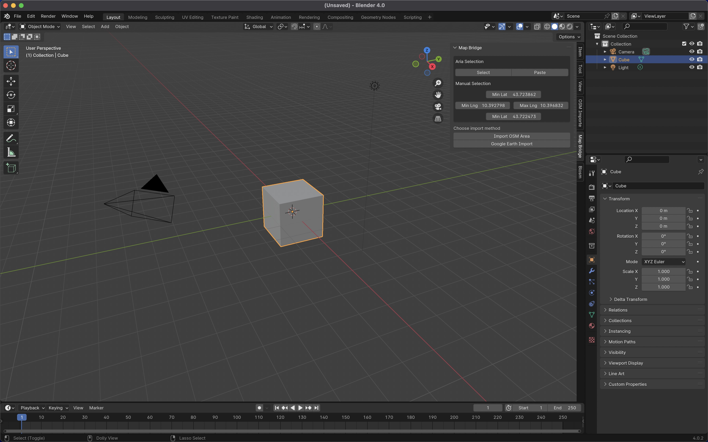
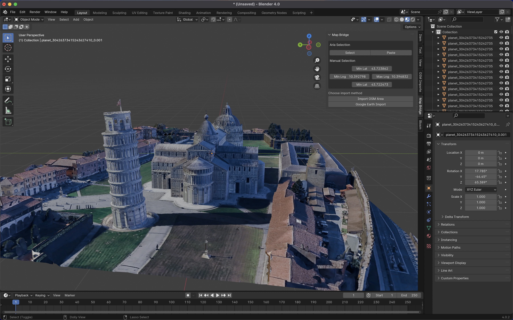
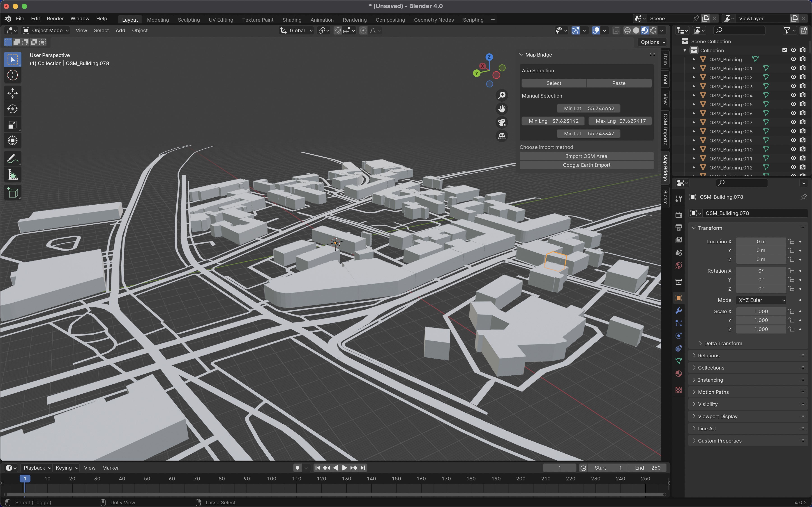
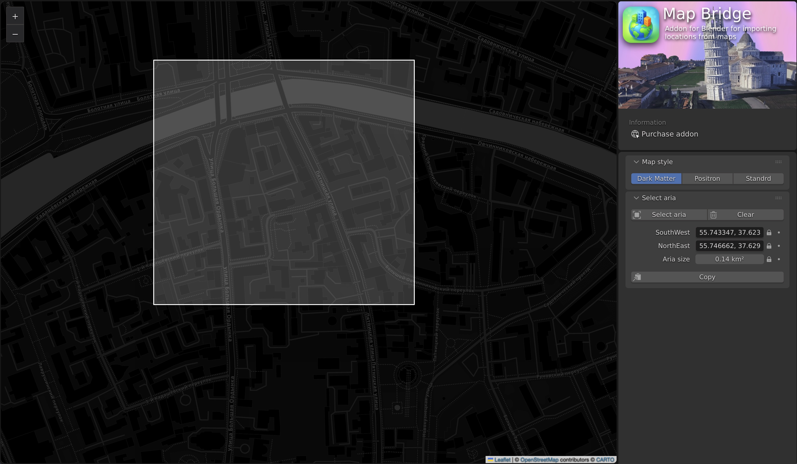

<p align="center">
  
</p>

<h1 align="center">Map Bridge</h1>

> Blender addon for importing maps

[](https://www.python.org/)
[](https://nodejs.org/)
[](https://www.typescriptlang.org/)
[](https://www.gnu.org/software/make/)
[](./LICENSE)

---

## 🌍 Description

**Blender Map Importer** is a Blender addon that allows you to import 3D scenes from **Google Earth** or automatically generate 3D environments based on **OpenStreetMap** data.

With just a few clicks, you can create a realistic geolocation directly in your Blender scene, including buildings, streets, and terrain.

## 🚀 Features

- 📦 Import 3D models from **Google Earth**
- 🗺️ Generate 3D scenes based on **OpenStreetMap**
- 🎯 Coordinate input support (latitude, longitude)
- ⚙️ Easy level of detail configuration

## 📷 Examples

<div align="center">




</div>

## 🚀 Use in Blender

To install the addon from a ready-made release:

1. Download the `map-bridge.zip` file from the [GitHub releases page](https://github.com/KIWIbird717/Map-Bridge-Addon/releases/tag/v0.1.0).
2. Open Blender and go to **Edit → Preferences → Add-ons**.
3. Click **Install...**, select the downloaded `map-bridge.zip`, and confirm.
4. Enable the **Map Bridge** addon in the list (use the search field if needed).
5. In the 3D Viewport, press **N** to open the sidebar and use the addon under the **Map Bridge** tab.

## 🚀 Installation & Usage

### 1️⃣ Prerequisites

- **Python** ≥ 3.11
- **Poetry** for dependency management
- **Node.js** ≥ 18 (for the web-based map selection tool)
- **Blender** ≥ 4.0
- **Make** (to run build scripts)

Install Poetry if you don't have it:

```bash
pip install poetry
```

Install Python dependencies:

```bash
poetry install
```

---

### 2️⃣ Available Commands

Run the following commands from the project root:

| Command               | Description                                                       |
| --------------------- | ----------------------------------------------------------------- |
| `make help`           | Show available commands                                           |
| `make build`          | Build the addon into a `.zip` archive                             |
| `make init-submodule` | Initialize and update the Google Earth importer submodule         |
| `make run`            | Install the addon into Blender and launch Blender with it enabled |

---

### 3️⃣ Build the Addon

```bash
make build
```

This will create a `.zip` archive in `dist` folder of the addon that can be manually installed in Blender via **Edit → Preferences → Add-ons → Install**.

---

### 4️⃣ Run Blender with the Addon

To automatically install and run the addon in Blender:

```bash
make run
```

---

### 5️⃣ Using the Addon

1. Open Blender.
2. Enable the **Map Bridge** addon in **Preferences → Add-ons**.
3. Access it in the **3D View → Sidebar (N) → Map Bridge** tab.
